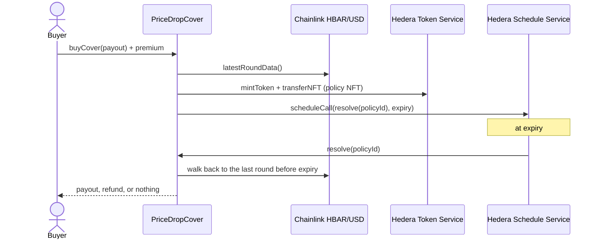

# HBAR price-drop cover

A Scaffold-HBAR template for parametric cover on Hedera. A buyer pays a premium and receives a policy NFT. If the Chainlink HBAR/USD price at expiry is below the policy's strike, the contract pays the NFT holder. Nobody files a claim and nobody runs a keeper: the contract schedules its own settlement with the Hedera Schedule Service when the policy is sold.

```bash
npm create scaffold-hbar@latest -- --template yuki-kawata/hbar-price-drop-cover
```

The scaffolded app points at a contract that is already live on Hedera testnet, so you can buy cover and fund the pool before you deploy anything.

> This template is experimental and not audited. Use it on testnet. Do not put real money in it without a security review and your own pricing model.

## What you get

| Piece | Where | What it does |
| --- | --- | --- |
| `PriceDropCover` | `packages/hardhat/contracts/PriceDropCover.sol` | Sells policies, schedules their resolution, pays out |
| `UnderwriterPool` | `packages/hardhat/contracts/UnderwriterPool.sol` | Holds underwriter HBAR as shares; locks capital behind open policies |
| `ChainlinkRounds` | `packages/hardhat/contracts/chainlink/ChainlinkRounds.sol` | Finds and proves the Chainlink round that was live at a given time |
| Cover page | `packages/nextjs/app/page.tsx` | Live price, quote, buy form, the connected wallet's policies |
| Pool page | `packages/nextjs/app/pool/page.tsx` | Pool balances, deposit, withdraw |
| Tests | `packages/hardhat/test/` | 36 unit tests with mocks of HTS, HSS and a Chainlink feed |

## How a policy works

1. An underwriter deposits HBAR into the pool and receives shares.
2. A buyer asks for a payout, for example 50 HBAR. The contract reads the Chainlink HBAR/USD feed and sets the strike 10% below the live price. The premium is 2% of the payout.
3. The contract locks 50 HBAR of pool capital, mints a policy NFT on the Hedera Token Service, and sends it to the buyer.
4. In the same transaction, the contract calls the Hedera Schedule Service (HIP-1215) to run `resolve(policyId)` at the expiry second.
5. At expiry, Hedera runs the scheduled call. The contract finds the last Chainlink round published before expiry:
   - price below the strike: the NFT holder receives the payout;
   - price at or above the strike: the locked capital returns to the pool;
   - no Chainlink update in the 3 hours before expiry: the policy is void and the premium goes back to the holder.



The policy NFT is the claim. If the buyer sells or sends the NFT, the new holder receives the payout.

## Why each integration is load-bearing

**Chainlink Data Feeds.** Cover has no meaning without an agreed price at two moments: when the policy is sold, and when it expires. The contract reads `latestRoundData` for the strike. For settlement it walks back through `getRoundData` to the last round published before expiry, so a late resolution cannot use a later price. If the walk-back is too long, anyone can call `resolveWithRound(policyId, roundId)`; the contract accepts the round only if it started before expiry and the next round started after it.

**Hedera Schedule Service.** Settlement at an exact second usually needs an off-chain keeper. Here the contract schedules its own call (`scheduleCall` on the system contract at `0x16b`) and checks `hasScheduleCapacity`, moving to the next free second when the expiry second is full. The pool pays the scheduled transaction's fee.

**Hedera Token Service.** Each policy is a serial of one NFT collection that the contract created and controls through its supply key. HTS keeps ownership on the ledger, so the mirror node can list a wallet's policies without an indexer. Accounts that do not auto-associate tokens must associate the collection first; the app detects this and shows an **Associate** button that calls the token's HIP-719 `associate()` function.

**Mirror node.** The app lists a wallet's policies with `/api/v1/accounts/{address}/nfts?token.id=…` and checks token association with `/api/v1/accounts/{address}/tokens`.

## Prerequisites

- Node.js 20.18.3 or later
- Yarn through Corepack: `corepack enable`
- A wallet that supports Hedera testnet JSON-RPC, for example MetaMask with chain 296 (`https://testnet.hashio.io/api`) or HashPack
- Testnet HBAR from the [Hedera Portal faucet](https://portal.hedera.com/faucet)

You do not need Foundry, Docker, or a local node.

## Quick start

```bash
yarn install
yarn start
```

Open http://localhost:3000. The app reads the testnet deployment in `packages/nextjs/contracts/deployedContracts.ts`.

- **Cover** (`/`): the Chainlink price, a quote for the payout you type, the buy button, and your policies with their schedule links on HashScan.
- **Pool** (`/pool`): pool assets, capital locked behind open policies, and deposit and withdraw forms.
- **Debug Contracts** (`/debug`): every contract function, for experiments.

## Deploy your own copy

```bash
yarn hardhat:account:generate        # stores an encrypted key in packages/hardhat/.env
# fund the printed address at https://portal.hedera.com/faucet
yarn hardhat:deploy --network hederaTestnet
```

The deploy script deploys `PriceDropCover`, creates the policy NFT collection, and regenerates `packages/nextjs/contracts/deployedContracts.ts`. You need about 20 testnet HBAR: token creation costs about 1 USD in HBAR and the contract deployment costs about 3 HBAR. Deposit HBAR into the pool from the Pool page before you sell cover.

To watch a policy resolve during a demo, deploy with a short cover period:

```bash
COVER_PERIOD_SECONDS=600 yarn hardhat:deploy --network hederaTestnet
```

## Environment variables

All variables are optional.

| Variable | File | Default | Purpose |
| --- | --- | --- | --- |
| `HEDERA_TESTNET_RPC_URL` | `packages/hardhat/.env` | Hashio | JSON-RPC for deploys |
| `HEDERA_MAINNET_RPC_URL` | `packages/hardhat/.env` | Hashio | JSON-RPC for mainnet deploys |
| `DEPLOYER_PRIVATE_KEY_ENCRYPTED` | `packages/hardhat/.env` | none | Written by `yarn hardhat:account:generate` |
| `COVER_PERIOD_SECONDS` | `packages/hardhat/.env` | `604800` (one week) | Cover length for new deployments |
| `POLICY_TOKEN_CREATION_FEE_HBAR` | `packages/hardhat/.env` | `15` | HBAR sent with `createPolicyToken` |
| `NEXT_PUBLIC_HEDERA_TESTNET_RPC_URL` | `packages/nextjs/.env.local` | Hashio | JSON-RPC for the app |
| `NEXT_PUBLIC_WALLET_CONNECT_PROJECT_ID` | `packages/nextjs/.env.local` | shared demo ID | WalletConnect |

## Cover terms

The deploy script sets these terms. They are immutable after deployment.

| Term | Value | Meaning |
| --- | --- | --- |
| `triggerDropBps` | 1000 | Strike is 10% below the price at purchase |
| `premiumBps` | 200 | Premium is 2% of the payout |
| `coverPeriod` | 7 days | Time from purchase to expiry |
| `maxPriceAge` | 3 hours | Oldest Chainlink round accepted at purchase and at expiry |
| `resolutionGasLimit` | 250,000 | Gas for the scheduled `resolve` call |

A flat premium is a teaching choice. A real product prices cover from volatility and pool use, and caps the payout per policy.

## Units: tinybars and weibar

Inside the EVM on Hedera, `msg.value` and balances are in tinybars (8 decimals). JSON-RPC and wallets send value in weibar (18 decimals). The contract works only in tinybars. The app converts once, in `packages/nextjs/utils/cover/hbar.ts`: it parses input to tinybars and multiplies by 10^10 only when it sets a transaction's `value`.

## Tests

```bash
yarn hardhat:test
```

Hedera's system contracts do not exist on the in-process Hardhat network, and the Hedera forking plugin cannot mint NFTs or schedule calls. The tests install mocks at the system contract addresses with `hardhat_setCode`:

- `MockHederaTokenService` at `0x167` creates the policy collection, mints serials, and returns `TOKEN_NOT_ASSOCIATED_TO_ACCOUNT` (184) for unassociated receivers, as Hedera does;
- `MockHederaScheduleService` at `0x16b` records scheduled calls and runs them on demand;
- `MockAggregator` publishes Chainlink rounds with chosen timestamps.

## Testnet proof

<!-- testnet-proof -->

## Project layout

```text
packages/
  hardhat/
    contracts/            PriceDropCover, UnderwriterPool
    contracts/chainlink/  feed interface and round lookup
    contracts/hedera/     HTS and HSS interfaces and addresses
    contracts/test/       mocks used only by tests
    deploy/               hardhat-deploy script
    test/                 unit tests
  nextjs/
    app/                  cover and pool pages
    components/cover/     forms, policy list, pool stats
    hooks/cover/          contract, feed and mirror node reads
    utils/cover/          units, formatting, mirror node client
```

## Troubleshooting

- **The buy transaction fails with `transferNFT` and code 184.** Your account is not associated with the policy collection and has no free auto-association slots. Press **Associate** on the Cover page, then buy again.
- **"No fresh Chainlink price".** The feed has not updated within `maxPriceAge`. Cover cannot be priced until it does.
- **A policy shows "Awaiting resolution".** The scheduled call has not run yet or ran out of gas. Press **Resolve now**; anyone may resolve an expired policy.
- **Withdraw is capped.** Capital that backs open policies stays locked until they resolve.

## Links

- [Chainlink Data Feeds on Hedera](https://docs.chain.link/data-feeds/price-feeds/addresses?network=hedera)
- [HIP-1215: Schedule Service calls from contracts](https://hips.hedera.com/hip/hip-1215)
- [HIP-719: token association from the EVM](https://hips.hedera.com/hip/hip-719)
- [Scaffold-HBAR docs](https://docs.hedera.com/solutions/tools/scaffold-hbar)

## License

MIT
